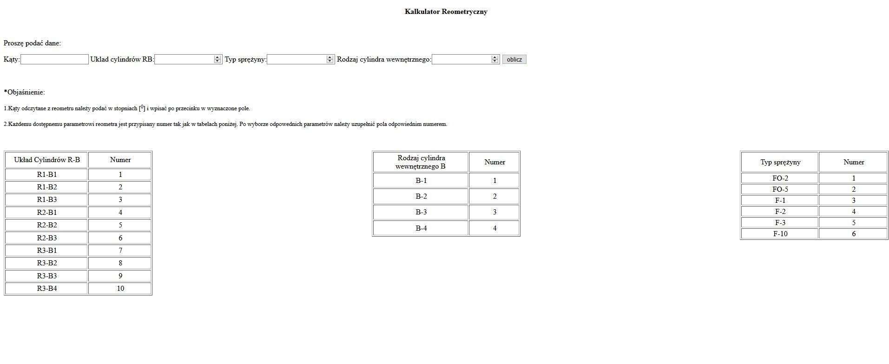
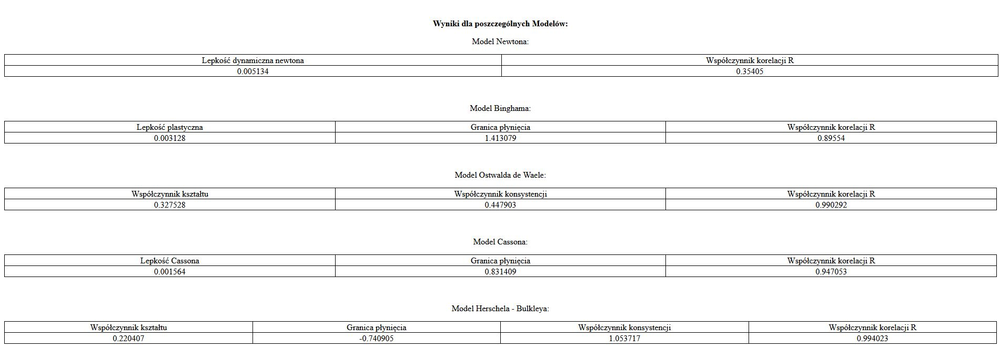

#  Rheological properties calculator
> Web app that helps in studing the rheological parameters of drilling fluids

## Table of contents
* [General info](#general-info)
* [Screenshots](#screenshots)
* [Technologies](#technologies)
* [Features](#features)
* [Status](#status)
* [Inspiration](#inspiration)
* [Contact](#contact)

## General info
Web app created in Django that helps the user examining drilling fluids to choose the right rheological model 
and calculate the most important rheological parameters. 

## Screenshots

## Technologies
* Python - version 3.7
* Pygame

## Features
List of features ready and TODOs for future development:
* Calculates the most important rheological parameters
* Shows a graf ilustrating the dependence between shear stress and shear rate for given fluid for all main rheological models
* Calculates the parameters for all main rheological models and choose the best model for given fluid

To-do list:
* Improve the interface and layout
* Add a database to store results for fluids
* Optimise the code
* Add English version

## Status
Project finished

## Inspiration
Project created as a part of my master’s thesis

## Contact
Created by [@Piotr Kowalewski](https://pkow.herokuapp.com) - feel free to contact me!
